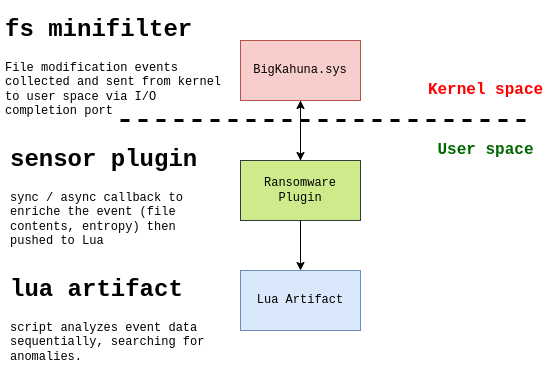

# Elastic Security Ransomware Protection Artifact Code

## How it works

The `artifact.lua` contains the Elastic Security detection logic to detect ransomware. This file is loaded by the [endpoint](https://www.elastic.co/security/endpoint-security).

    

Our detection framework is based on a **scoring system**; as file modification events come in, we continue to evaluate them against our ransomware detection heuristics. Each file event may or may not increase the score depending on how anomalous it appears to be. If the score reaches a certain threshold, we raise an alert and terminate the malicious process.

## Detection features

- We use a wide variety of techniques to detect anomalous behavior:
    - ✔️ **Header Mismatch**: when the file header magic does not match the expected sequence of bytes.
    - ✔️ **Entropy Mismatch**: when the file entropy is larger than the expected entropy range.
    - ✔️ **Path History**: evaluates the current event and how it relates to previous events involving the same filepath within the same process. In particular, we seek to find anomalous file modification patterns that may not be apparent when analyzing the current event in a vacuum (e.g. deleting and creating the same filepath).
    - ✔️ **Abnormal Extensions**: performs various heuristics over the sub parts of a file extension.
    - ✔️ **Ransom Notes**: checking for various pattern found in random notes dropped by ransomware.
    - ✔️**Canary Files**: drop several canary files and monitoring them for encryption.
    - ✔️ **Known ransomware extension**: a quick and easy way to detect previously known families.

## Questions? Suggestions?

Want to know more about how our ransomware protections works? Check out a [blog overview](https://www.elastic.co/blog/ransomware-protection-in-the-open-advancing-efficacy-through-community-collaboration) explaining more details. If you’d like to report a false positive or missing coverage for a malware family, please create a GitHub issue and check if there's an existing one first.
